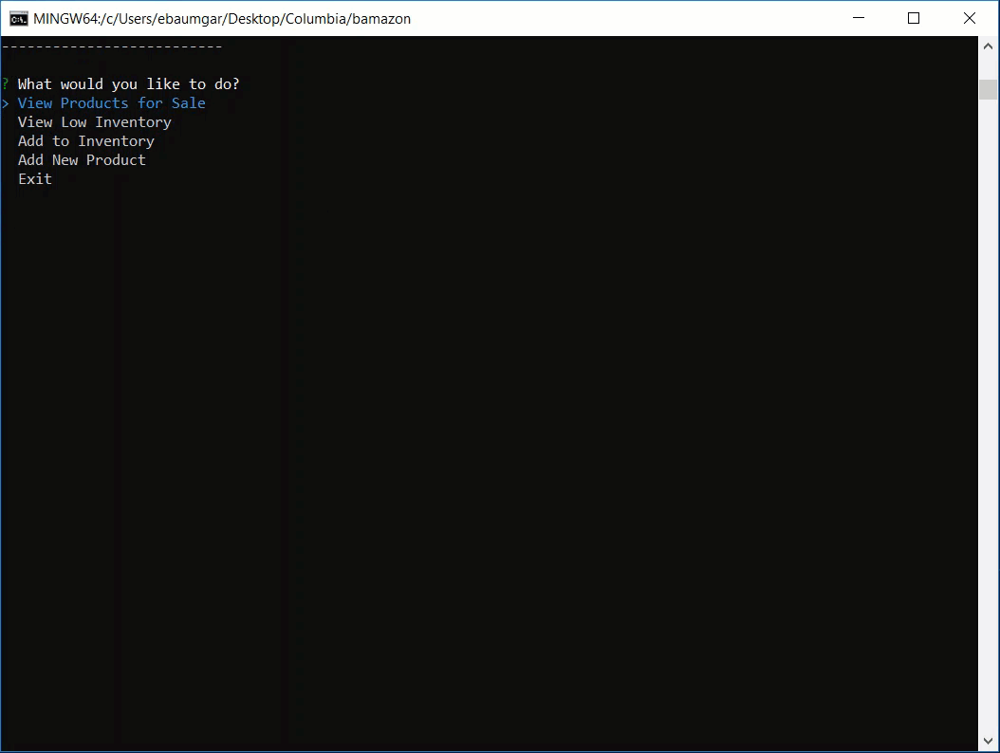

# bamazon
An Amazon-like storefront with the MySQL. The app will take in orders from customers and deplete stock from the store's inventory. This app will also track product sales across the store's departments and then provide a summary of the highest-grossing departments in the store.

**Starting command line actions:**
Input into the command line to enter the application
* node bamazonCustomer.js
* node bamazonManager.js

================================================================
## Functionality for bamazonCustomer.js 
### _Customer View_
Running this applicaiton will propt the user to first enter the *bamazon store, and then displays all the items in the store within the command line (aka, table details from the mySQL database). The the following happens in order:

1. The user is propmted which item they want to buy and what quantity. 

1. The request is then processed if enough quantiy of that item is available, otherwise the user is notoified that there is not enough quantity and to update their order. 

1. After an order is processed, the total price for the item and quantity is displayed to the user and the database it updated with the new stock amount. 

1. Lastly, the user is prompted if they would like to make another order, or exit the store.

================================================================
## Functionality for bamazonManager.js
### _Manager View_
Running this applicaiton will propmt the user to select an action:
* View Products for Sale
* View Low Inventory
* Add to Inventory
* Add New Product

-----------------------------------------------------------------
### View Products for Sale
This option will display all the products in the store with the following info in the terminal:
* ID
* Product Name
* Price
* Quantity Available

-----------------------------------------------------------------
### View Low Inventory
This option will display items in the terminal that have an invetory less than 5.

-----------------------------------------------------------------
### Add to Inventory
This option allows the user to add more inventory of the product that updates the database.

-----------------------------------------------------------------
### Add New Product
This option will allow the user to add a new product to the database of products so that it will be a part of the store.

